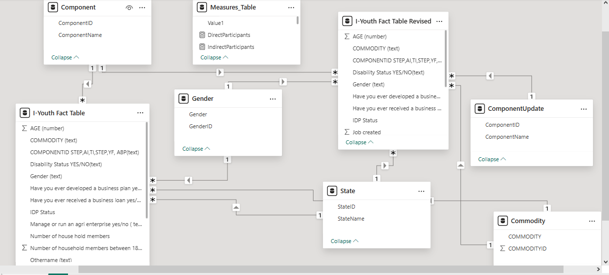
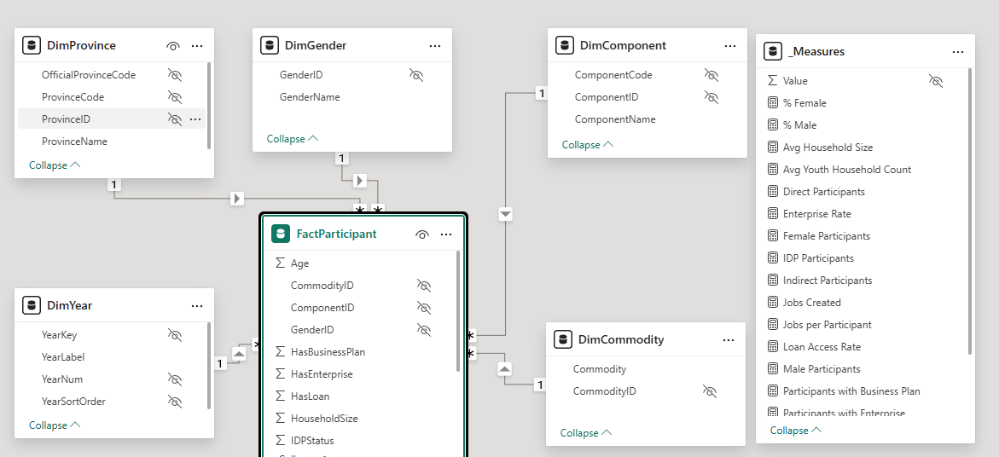
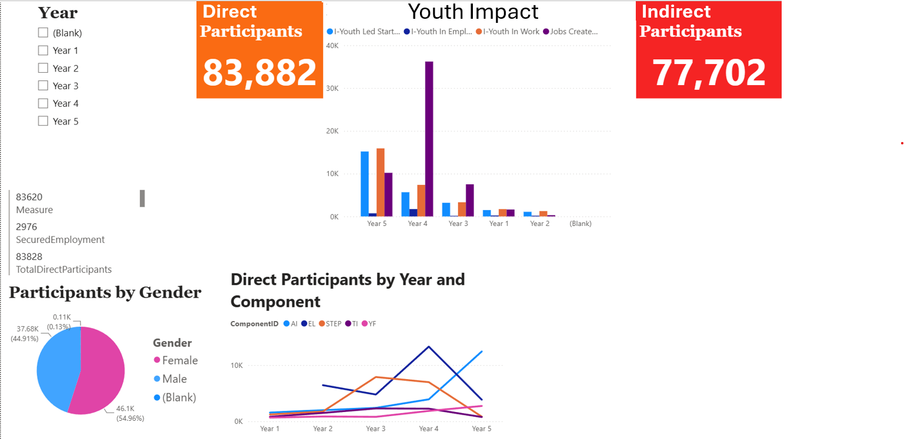
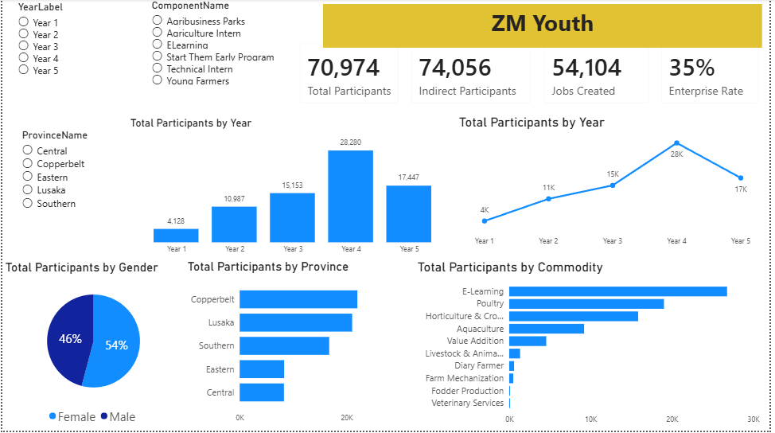

# iYouth MIS Data Model Refactor

> Refactoring a dataset with data quality and modelling limitations into a robust, analytics-ready MIS system (SQL Server + Power BI)
## Overview
This project demonstrates the redesign of an M&E dataset with legacy reporting constraints into a robust, analytics-ready MIS system.

The original dataset contained:
- Duplicate participant records
- Inconsistent categorical values (Commodity, Gender, etc.)
- Undefined analytical grain
- Non-standardized reporting structure

## Solution
The system was refactored using:

- SQL Server → Data cleaning, deduplication, dimensional modeling
- Power BI → Semantic model, DAX measures, dashboard

## Final Architecture

Fact Table:
- FactParticipant

Dimensions:
- DimProvince
- DimComponent
- DimCommodity
- DimGender
- DimYear

## Key Improvements

- Defined grain: ParticipantID + ComponentID + YearKey
- Removed duplicates using ROW_NUMBER()
- Standardized categorical variables
- Implemented star schema
- Built accurate DAX measures (DISTINCTCOUNT, CALCULATE)

## Outputs

- Clean analytical dataset
- Power BI dashboard (KPIs, trends, breakdowns)
- Structured MIS-ready data model

## Purpose

This project demonstrates capability to design and implement robust MIS systems aligned with M&E requirements.

## Before vs After (Visual Evidence)

### Data Model Transformation

**Before (Unstructured Model)**  

**After (Star Schema Design)**  

---

### Dashboard Transformation

**Before (Inconsistent Reporting)**  

**After (Structured MIS Dashboard)**  

## Project Structure

01_Source_Data/ → Source data folder reserved for sample/raw data
02_SQL_Transformation/ → Data cleaning, deduplication, and fact build scripts
03_Data_Model/ → Star schema design and model screenshots
04_PowerBI/ → Dashboard screenshots and visual outputs
05_Documentation/ → Methodology, DAX, and design documentation
